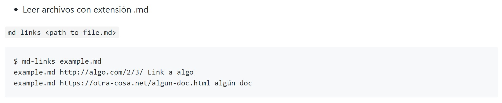
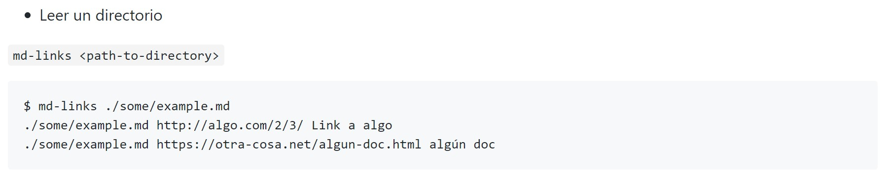

# Markdown Links

Extrae los links de tus directorios y/o archivos markdown (.md).

## Preámbulo

[Markdown](https://es.wikipedia.org/wiki/Markdown) es un lenguaje de marcado
ligero muy popular entre developers. 

Estos archivos `Markdown` normalmente contienen _links_.

Dentro de una comunidad de código abierto, nos han propuesto crear una
herramienta usando [Node.js](https://nodejs.org/), que lea y analice archivos
en formato `Markdown`, para verificar los links que contengan y reportar
algunas estadísticas.

 ## Cómo se instala?

Para usar esta biblioteca instala:

npm install @jocecasteletti/md-links --save

## Comando línea de interfaz

Ejecución de la librería:

## Leer un directorio

 En ambos casos, se obtiene como resultado:

### Dependencias:

* node.js versión v11.8.0
* chalk 2.4.2
* yargs 13.3.0
* jest: 24.8
* chalk: 2.4.2
* filehound: 1.17.0
* marked: 0.6.2

### Planificación

Puedes seleccionar [aquí](https://trello.com/b/vTQ9Thfe/md-links)
 para conocer la planificación realizada con la plataforma utilizó Trello.

Autor
Jocelyn Casteletti